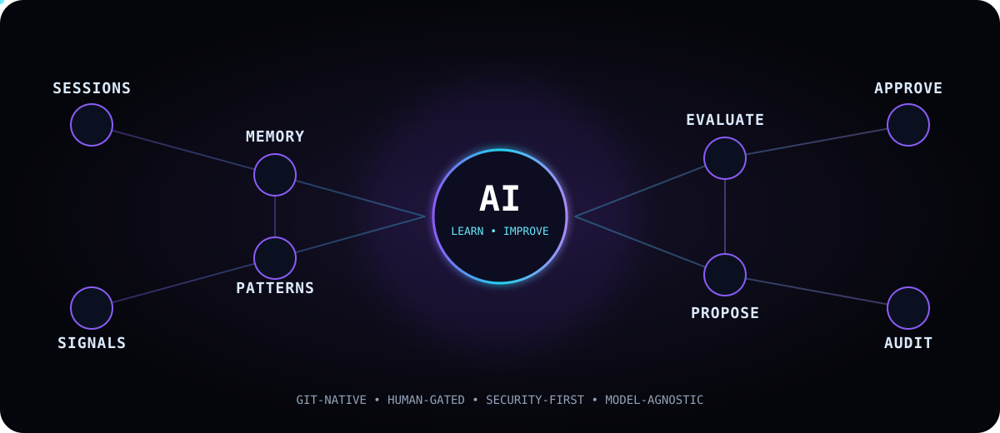

<div align="center">



# 🧠 Self-Improving Engineering Agent

### A secure, Git-native learning loop for Claude Code

**Learn → Remember → Evaluate → Propose → Approve → Improve → Audit**

[](https://github.com/saurabhjaju2418/self-improving-engineering-agent)
[](https://docs.anthropic.com/en/docs/claude-code)
[](https://git-scm.com/)
[](#-safety-model)

</div>

## What is this?

An open engineering-agent framework inspired by self-improving agent workflows, but designed to keep **the developer in control**.

It turns useful signals from Claude Code sessions and engineering work into durable, reviewable knowledge. The agent can propose improvements to its own engineering memory and rules, while Git, policy gates, and human approval determine what becomes permanent.

```text
Claude Code / VS Code
        │
        ▼
   Session Signals
        │
        ▼
 ┌──────────────────┐
 │  Learning Engine │
 │  • patterns      │
 │  • mistakes      │
 │  • decisions     │
 │  • preferences   │
 └────────┬─────────┘
          ▼
   Engineering Memory
          │
          ▼
 Improvement Proposal
          │
     ┌────┼────┐
     ▼    ▼    ▼
    AUTO REVIEW BLOCK
     │    │    │
     └────┼────┘
          ▼
     Git / Audit Log
```

## ✨ Core principles

| Principle | Design |
|---|---|
| **Git-native** | Knowledge and changes remain reviewable in Git |
| **Human-gated** | Important improvements require explicit approval |
| **Local-first** | Start without sending an entire codebase to a hosted service |
| **Policy-driven** | Auto, review, and blocked changes are explicit |
| **Auditable** | Every durable learning event can be traced |
| **Security-first** | Secrets, permissions, production changes and security weakening are never autonomous |
| **Model-agnostic** | The learning architecture should not depend on one model vendor |

## 🚦 Safety model

### 🟢 Auto-apply

Low-risk knowledge maintenance:

- prompt wording improvements
- duplicate-memory cleanup
- documentation improvements
- reusable test-generation hints
- low-risk pattern normalization

### 🟡 Human approval

Engineering policy or behavior changes:

- coding standards
- architecture conventions
- CI/CD rules
- dependency recommendations
- GitLab/GitHub workflow rules
- security recommendations

### 🔴 Blocked

Never autonomous:

- credentials, tokens, or secrets
- permission/access changes
- production deployment
- branch protection changes
- security bypasses
- destructive operations
- weakening security controls
- arbitrary production-code self-modification

## 🗂️ Planned architecture

```text
.claude/                 Claude Code commands + skills
memory/                  Durable engineering knowledge
learning/                Proposed / approved / rejected changes
policies/                Auto / review / blocked rules
scripts/                 Analysis and learning utilities
sessions/                Sanitized session-derived artifacts
.github/                 CI, security and project automation
```

## 🧠 Learning loop

1. **Observe** — collect useful engineering signals.
2. **Extract** — identify patterns, decisions, mistakes and successful approaches.
3. **Evaluate** — score confidence, novelty, risk and recurrence.
4. **Propose** — generate a small, explainable improvement.
5. **Gate** — classify it as auto-apply, review, or blocked.
6. **Apply** — write only approved changes.
7. **Audit** — record what changed, why, and which evidence supported it.
8. **Repeat** — use future sessions to validate or invalidate the learned rule.

## 🛠️ Roadmap

### Phase 1 — Foundation

- [x] Repository
- [x] Animated project identity
- [ ] Claude Code command structure
- [ ] Memory schema
- [ ] Learning proposal schema
- [ ] Safety policies
- [ ] Local session analyzer
- [ ] Approval workflow
- [ ] Tests

### Phase 2 — Self-improvement engine

- recurring-pattern detection
- contradiction detection
- confidence scoring
- proposal generation
- approval/apply workflow
- immutable-ish audit trail through Git

### Phase 3 — Engineering integrations

- GitHub
- GitLab
- merge requests / pull requests
- CI failures
- test failures
- static-analysis findings
- security findings

### Phase 4 — Engineering Brain UI

A lightweight dashboard for:

- learned patterns
- pending improvements
- confidence scores
- decision history
- safety events
- learning velocity

### Phase 5 — Dream / scheduled learning

```text
Daily sessions
     ↓
Nightly analysis
     ↓
Lessons + proposals
     ↓
Policy evaluation
     ↓
Safe auto-apply / human approval
     ↓
Morning engineering brief
```

## 🔐 Security philosophy

> **The agent may improve its knowledge, but it may not redefine its own authority.**

The policy layer is deliberately outside the learning loop. A learned instruction cannot grant itself permission to access secrets, deploy production code, modify security controls, or bypass human approval.

## 🤝 Project goal

Build a practical, open, inspectable alternative to opaque self-improving agent systems — optimized first for software engineering workflows and eventually extensible to other agentic systems.

## 📄 License

MIT — planned for the first stable release.

---

<div align="center">

**Built for engineers who want AI that gets better without giving up control.**

</div>
